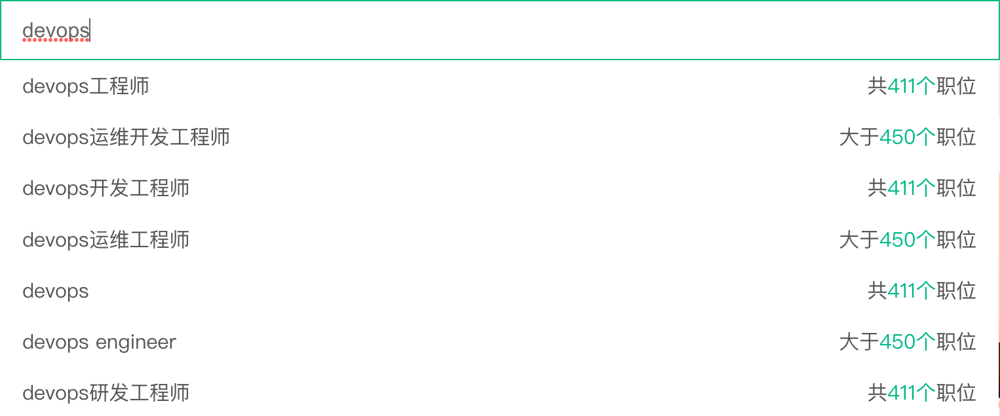
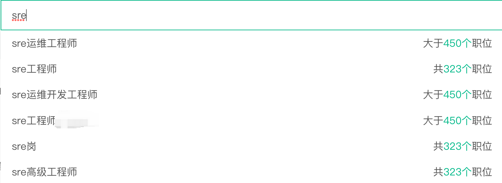

> Note: 以下观点不代表本人就职的公司。系作者个人观点。这些观点和作者的本人工作经历有关，可能不够面面俱到。

## 从Devops的由来说起

> 近些年，DevOps以及SRE的宣传和布道在国内越来越多，在各招聘平台也可以看到这些职位的招聘信息(出现具体公司信息的，隐去)，以某招聘网站，地点选择北京，分别搜索devops和sre我们可以看到
devops的职位

sre的职位

几乎所有的互联网公司都在提出做DevOps建设(当然了，不然怎么会有这些职位的招聘呢:)
有的公司还有SRE团队
- 有的公司并没有区分DevOps/SRE，他们有所不同吗？
- DevOps与CICD有什么关系呢?
- 稳定性建设/SLA/SLO究竟是谁来负责呢?
- 等等，好像还看到过PE工程师，还有NoOps的提出
- 安全的同学说，我们还有DevSecOps

各位，有没有好奇过这些？没有的话，那现在你可以好奇一下来。本文会一一道来。

这些职位到现在的发展，在有的招聘中已经和当时提出来的时候的概念不太一样了。
但这不要紧，我们可以先从这些职位的溯源来看他们提出来的时候的背景和当时的要求。

其实，DevOps本身是一种技术文化，它本身旨在打破Dev和Ops之间的墙，让大家的沟通更顺畅。

DevOps正式的被提出是在计算机届知名的出版公司O'reilly举办的Velocity大会上，在2008年的Velocity大会上，一场名为[10+ Deploys per Day: Dev and Ops Cooperation at Flickr](https://www.oreilly.com/library/view/devops-in-practice/9781491902998/video169253.html)的演讲带来了DevOps的说法，我们现在还可以在O'reilly的网站上看到这个视频。

在这场演讲中，John Allspaw(Flickr的运维团队的总监)提出了要“**构建快速发布软件的工具和文化**”，**注意，敲黑板，这里不仅有工具，还有文化**。
此后，几乎所有谈到DevOps理念的都会提到这场演讲。Patrick当时并没有在会议现场，但他后来观看了会议视频，深有同感，这为DevOps埋下了种子。
Patrick随后在Twitter上表示，他也想参加Velocity大会，一些工程师回应他，你可以举办你自己的Velocity大会，我们都去参加。
时间又到了2009年，这一年，Patrick通过Twitter召集了本年的社区版“Velocity大会”，并在比利时举行。由于是个会议，Patrick得起个名字，他就想到了Dev和Ops，由于会议举行了两天，于是会议被命名为DevOps Days。

这也是DevOps领域著名的会议：DevOps Days的第一次首秀，本次会议结束后，参会的工程师和管理人员们带着Devops的理念回到世界各地，逐渐的在全世界范围内推广和实践DevOps。

## DevOps在做什么

*Photo by PCB-TECH on https://pixabay.com*

说了这么多，那么DevOps究竟要做什么?
正如最早提出DevOps的2008年的Velocity大会所说，DevOps的关注点之一，在快速发布软件的工具和文化。
与此对应，并由此延伸的：**持续集成，持续交付，持续部署**，甚至发展了持续规划，持续测试等等。如果你想知道还有哪些持续什么，可以参看这篇文档[微软关于DevOps的介绍](https://docs.microsoft.com/en-us/learn/modules/introduce-foundation-pillars-devops/2-discover-devops)

不管怎样，DevOps的宗旨都在于尽可能多的，尽可能快的集成/部署/交付。

通过CICD（持续集成和持续交付）流水线的设计，**尽可能“快速失败”**。所谓尽可能“快速失败”是为了让失败能尽早进行，尽早看到，尽快修改。
在这过程中，提倡测试尤其是自动化的测试更早的介入，所谓“**测试左移**”。

> 我们回忆一下（可能有的同学回忆不了，没经历过那个时代）手工运维的时代：在没有任何自动化设施的软件公司，怎么发布软件：研发按需求开发，在本地打包构建，把包给运维同学，运维同学把包上传到服务器，修改配置文件为生产环境配置，重启服务以生效。
> 哦，好吧，每次发布都是折磨人，尤其是随着节点规模的逐步的扩大，每操作一个节点，就要把上述操作全部进行一次，简直了，忍受不了。是的，那就需要DevOps，拒绝手工。

### 流水线，CICD

如上，想象一下没有流水线的场景，我们需要手工做CI持续集成：代码lint，单元测试，构建。然后再做发布验证。
如果不能自动化的做这些，那么，就不能**尽可能多和尽可能快**的**持续交付价值**。

在这个过程中，可以从几个纬度来考量DevOps带来的益处:
- 提高部署效率和频率
- 缩短部署前置修改时间
- 快速回滚（恢复）的速度
- 提高更高的失败率

这些为什么重要呢？从交付速度 角度来说，越快的加速交付，就能越快的去验证商业逻辑、试错、提高bug修复到客户看到效果等各种过程的速度。

### 敏捷与DevOps

不管是国内，还是国外，提到敏捷，就绕不开DevOps。
我们回忆一下上文提到的Patrick老哥，他在Agile 2008 大会上的演讲中谈到可以将 Scrum（敏捷一种实现）结合运维中。Patrick在一个测试数据中心迁移的项目与开发和运维团队一起工作。在他的工作中，需要频繁往返于开发与运维之间。

而敏捷所强调的小步快跑，持续交付等理念正需要DevOps在技术上的有效支持才能落地，否则，敏捷的这些环节就是空中楼阁。

同时，DevOps也借鉴了Scrum的理念，在Dev的用户故事之外提出了测试故事和运维故事。
并且在继承了Agile的理念的同时，更强调了**软件开发生命周期的理念（SDLC）**，强调了并不是编码和测试完成就是软件开发的结束。还需要运维的管控。

而对于传统的运维流程 ITIL。DevOps则是有选择的吸收，要有流程，但不是受制于流程，且流程的变更应该是自动化工具实现的推动和数据的流转，而不是依赖人工。

### DevOps文化

#### 打破部门墙，树立Ownership

这是在务虚吗？不完全是。
DevOps的确强调文化。我们又要提到Patrick老哥，前文已述，他的工作要频繁的往返于开发和运维之间。
而这两个团队，其实在DevOps理念广泛的被接受之前，两个团队是割裂的：Dev更喜欢尽快验证上线，而OPS团队则希望尽可能少的变更，毕竟，越少的变更，越不容易出错。

而且，这两个团队的技术栈也有所不同，比如在早点的时候，国内一些公司，以本文作者经历过的一些不同的100多人的技术团队到几百人的技术团队到2000人左右的技术团队：一些传统的运维不会开发，只写业务逻辑的开发不懂系统层/网络层的技术，这会导致两个团队的沟通成本比较高，除此之外，由于Dev如果只关注写业务逻辑，不知道生产环境的整体架构全貌，生产环境出了问题，需要找OPS了解生产环境，排查时间也会变长。

DevOps正是要打破这种部门墙，让Dev和OPS有效的沟通：
- 从技术栈来说：OPS需要学习开发的知识，以便可以开发DevOps工具和平台，高效的完成DevOps工作。Dev也需要了解系统层面、网络层面的知识，去了解生产环境的架构，以更清楚的知道产品在技术层面的全貌，有利于对问题的分析和排查。
- 从**Ownership**的角度来说，都要有主人翁精神，对自己负责的产品有Ownership意识，而**Ownership**并不是务虚的，而是要通过DevOps的技术建设，让研发能够参与到发布之中。而在自动化建设不好的环境下，甚至需要专人来进行发布，Dev也不知道如何进行CICD，这里，建议不要用权限控制来说事，权限控制可以通过技术来实现，给予必要且刚好够用的权限，让Dev能够自己发布自己的产品，解放OPS的人力不是去专门的做发布点击工程师：）

关于DevOps不仅仅是工具，更应该是关于有效协作和沟通的文化，可以参看[scrum.org](https://www.scrum.org)的一段描述：

> DevOps is more about Organisation Culture than about Tools
>
> In fact, as we have learned tools and automation is only one-third of DevOps (I would say it is even less). In overall, DevOps is about Collaboration & Collective Ownership, Focus on the flow of value delivery and Learning and experimentation culture. But sadly, many tooling vendors position DevOps as tools and process for delivery pipeline (the vendors that I've witnessed in my market are more focused on tools but your experience may be different to mine). This will get the management excited because many managers whom I've met think that after buying and installing the "DevOps" tools without changing their organisation will make their company instantly agile. This is like putting the cart in front of the horse.

仅仅以为引入了自动化工具就是DevOps是不够的，还需要协作，关注价值传递。

#### 康威定律与组织建设

**康威定律： 设计系统的组织，其产生的设计和架构等价于组织间的沟通结构。**

组织架构和技术架构是有相应的映射关系的，有什么样子的组织，就有什么样的技术架构。
严格讲究职能边界的企业是很难有效的推广微服务和DevOps的。

在一个企业发展初期，工程师可能都是多面手，可以完成开发和运维等诸多工作，这种情形下，沟通是高效的。随着企业的发展， 有了独立的PM、QA、DEV、OPS等部门，不同的团队之间就会出现耦合和依赖，这会降低沟通效率和提高部署的成本：一个产品的上线要经过诸多沟通甚至人工的审批。

微服务的提出，要求团队之间解耦，团队要能在技术上自治，可以自己进行开发和运维，通过系统调用或者接口调用完成自服务和自运维。

我们如果朝着减少组织各个团队之间不必要的沟通和协同（注意，不是不要沟通和协同，而是减少不必要的沟通和协同）的时候，组织的自运行效率就会上升。

反之，各个团队之间通过比如PM来协调资源和沟通，就难以形成微服务的技术架构，而是会形成分层的技术架构。

这里，要特别指出，让运维团队参与研发日常活动，比如每日站会，也会让运维更好的理解研发工作和分享团队内部信息，对齐目标。

PS：安全的同学吸收DevOps的理念，强调Dev/Sec/Ops三者的协作，并把DevOps的方法融入到安全的工作中，就是DevSecOps了。

#### 说了这么多，DevOps只关注交付吗

好了，这个标题是故意的，是为了引出SRE。
交付之后呢？就不管了吗？
一个应用上线之后，优化它，持续迭代（持续迭代还是偏Dev和CICD），还有，还要持续监控它，最好能提前发现故障的迹象，及早的消除故障，甚至消除故障出现的可能。

当遇到流量压力，应该可以**快速的水平扩容，扩容是无感知的**。
应当关注SLO（service-level object），并有合理的SLA（service-level agreement）。

而这些是DevOps应该关注的吗？其实这个说法不一，以作者的个人经历认为：DevOps既然是持续的关注交付价值和价值的流动，那么价值的流动并没有到交付就结束。而监控/无感知扩容/服务质量保证都是DevOps可以关注的。不应该局限于具体的技术名词的限制。但在实际工作中，可以有专注的领域，毕竟，人的精力和专注度是有限的。

## SRE & SRE vs DevOps

> sre是由google提出的：Site Reliability Engineer （网站可靠性工程师）。
> 在google的说法里，sre是devops的落地。

SRE的首要任务是保证SLA，重要的是，SRE的工作出发是以开发人员扮演的角色，SRE都是从研发来的，而不是传统的运维。这是SRE和传统运维最大的不同。

SRE是替代原有IT操作的一种方式，强调以自动化，编写工具的方法解决，即treat [IT] operations as if it’s a software problem。

SRE关注以下几个方面

- 容量规划
-  冗余和容错
-  流量过载
-  负载均衡
-  监控
-  救火（没有看错）

SRE强调尽可能自动化的以编程的方式完成这些工作，但必须承认，有些工作可能是不好自动化的，比如Troubleshooting。
在Google的SRE体系中，SRE工程师将花费大约一半的时间来开发新的工具和服务，这些工具的一部分用于自动化一些手动任务，而其他部分用于来不断填补和修复整个SRE体系内部的其他系统。
对Google的SRE理念和他们的实践感兴趣的，可以阅读[SRE: Google运维解密]，英文版是[Site Reliability Engineering: How Google Runs Production Systems]。
这是GoogleSRE团队编写的书籍，全书从SRE工作的各个方面讲述了SRE在Google是如何落地实践的。

同时，也可以看到，对于流量过载和容量规划的需要，以及系统应对流量过载的做法：快速无感知的水平扩容，这就需要**云原生的技术，k8s容器化、自动化的扩容，加入服务**。
SRE对于监控系统的需要，在传统的监控系统的基础上发展了可观测性的理念。

SRE是DevOps的落地，SRE更偏向技术实践，而DevOps还有组织文化和流程等内容。
但两者不是对立的，恰恰相反，SRE 工作就是开发和运维有效的结合，正是DevOps理念非常好的实践。

## PE/NoOps/AIOps
PE就是应用运维工程师，是国内很多公司的运维的实际角色。和SRE（真正的SRE）的不同是，PE偏向只是应用运维。

NoOps是一些公司提出的理念，本质还是在于消除手工运维，而不是消除运维，而是要通过解放原来的手工或者低效的沟通，解放原来运维做的大量的重复的、手工的比如仅仅是权限原因，有专职的发布运维；DBA天天在复制粘贴开发提交的SQL等工作。
而通过DevOps/SRE的建设，让运维和DBA去干真正有价值的事情，比如关注中间件的原理和大规模实践，成为有专长和深耕的技术人，并在这些方面的运维有建树。

AIOps是这几年才有的概念，但作者个人的经历结合看到的DevOps产品来说，由于实际生产环境的复杂多样性，目前还没有AI来做OPS/DevOps/SRE，哪个公司敢让AI决定怎么Troubleshooging?至少目前还没有，当然，技术的发展是超出人们想象的，也许有一天，AIOps或者是其他的某个XXOps真的可以实现智能运维。

## 总结

国内很多公司，SRE还停留在口头，参看很多招聘的jd就可以知道，其实只是应用运维换了个说法，包括一些DevOps/运维开发的岗位需求也是，其实主要工作还是应用运维，即：部署/上线/监控/TroubleShooting/On call。
其实，不管是DevOps,还是SRE，都在强调自动化。在这一点上，我们可以不那么在意这么多上述名词的区别，毕竟落地到工作中，都是很实在的工作。
可以先从高效的自动化开始，建设自己的DevOps/SRE体系。

可以尝试向真正的DevOps或者SRE转变，可以做先吃螃蟹的人。

如果你还在为部署/配置/整合打通各种Devops工具费神，可以看看一个神奇的网站：[DevStream官网](https://www.devstream.io)的开源工具：[DevStream](https://github.com/devstream-io/devstream)，它会帮助你向真正的DevOps更进一步，在此基础上，你可以更好的学习和成长，以至于成为google定义的真正的SRE。
